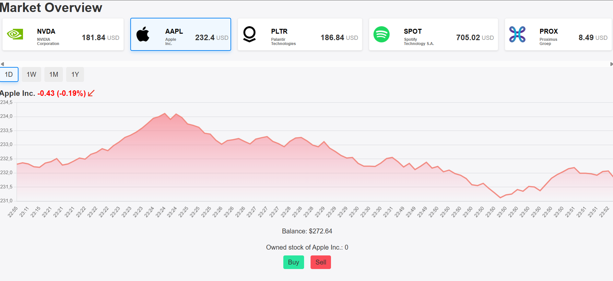
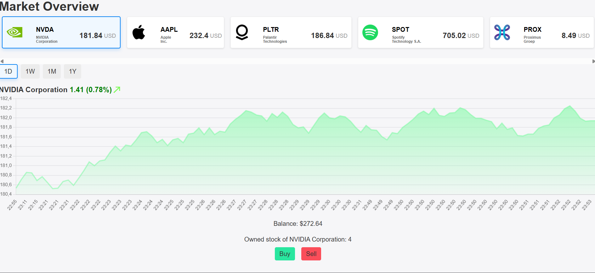

<h1 align="center">
  Development V - Remedial assignment<br>
  📈Stock Market Simulation📉
</h1>

## Overview 📜

This project was created as part of the "Development V course assignment @EHB.
The project is a stock market simulation made with Next.js and Supabase. Users can view a handfull of stocks, their prices, and historical data, which are all kept in the Supabase database. Users can also simulate buying and selling stocks, with their portfolio being stored in the browser's localStorage. Every user starts off with a virtual balance and can make trades to try and grow their portfolio.

## Features ⚙️

- View a list of available stocks with their current prices
- Simulated real-time stock prices and historical data
- Simulate buying and selling stocks
- Virtual portfolio managed with localStorage
- Charting library for visualizing stock price trends
- Cycle between different time periods for price data
- Reusable components, utility functions, and service functions for data fetching and manipulation

## Installation 🛠️

1. Clone the repository:

   ```bash
   git clone https://github.com/EHB-MCT/remedial-assignment-mikolajbuelens.git
   cd stock-market-sim
   ```

2. Install dependencies:

   ```bash
   npm install
   ```

3. Set up environment variables:

   - rename the `.env.example` file in the root directory to `.env.local` and replace with your Supabase credentials:
     ```plaintext
     NEXT_PUBLIC_SUPABASE_URL=your_supabase_url
     NEXT_PUBLIC_SUPABASE_ANON_KEY=your_supabase_anon_key
     ```

4. Run the development server:
   ```bash
   npm run dev
   ```

## Usage 📖

1. **Viewing Stocks**: Select one of the companies from the list to view its details, including current price and historical data.

2. **Simulating Trades**: Use the provided UI to simulate buying and selling stocks. Your virtual portfolio will be updated accordingly and stored in the browser's localStorage.

3. **Viewing Price History**: Access the price history for each stock and cycle through different time periods to analyze past performance.

4. **Getting new prices**: Every 10 seconds, the app fetches new prices from the API and updates the displayed stock prices in real-time.

## Screenshots & demo 👀

### Deployment: https://remedial-assignment-mikolajb-git-fe9925-mikolajbuelens-projects.vercel.app/market-overview <br>

<br> <br>




## Project Structure 📂

```plaintext
stock-market-sim/
├── src/
│   └── app/
│       ├── _lib/
│       ├── (dashboard)/
│       ├── (stocks)/
│       ├── api/
│       │   ├── companies/
│       │   ├── price-history/
│       │   └── update-price/
│       ├── components/
│       ├── services/
│       ├── styles/
│       │   ├── components/
│       │   ├── layouts/
│       │   ├── reset.css
│       │   └── globals.css
│       ├── hooks/
│       ├── seeders/
│       └── utils/
├── __tests__/
├── docs/
│   └── progress.md
├── README.md
├── CHANGELOG.md
├── LICENSE
├── CONTRIBUTING.md
├── CODE_OF_CONDUCT.md
├── .gitignore
├── package.json
├── jest.config.js
└── next.config.js
```

## Branches 🪵

#### High-Level Overview of current branches

- main
- develop
- feat/setup-nextjs -> initial setup for Next.js
- feat/chart-ui -> implemented chart UI components
- feat/db-connection -> established Supabase database connection
- feat/company-list -> created company list view with a company card component
- feat/price-simulation -> added price simulation logic (creating/updating simulated prices)
- feat/price-display -> Displayed prices from DB in chart and cards
- feat/get-new-prices -> Fetch new prices from the API at regular intervals (currently every 10 seconds)

## API Endpoints 🔌

| Method | Endpoint           | Description                                                                 |
| ------ | ------------------ | --------------------------------------------------------------------------- |
| GET    | /api/companies     | Fetch all companies.                                                        |
| POST   | /api/update-price  | Insert/update stock prices for all available companies.                     |
| GET    | /api/price-history | Fetch the latest stock prices for all companies. Price + timestamp history. |

## Sources 📚

### Documentation

- [Next.js Documentation](https://nextjs.org/docs), more specifically:
  - [How to use Jest with Next.js](https://nextjs.org/docs/app/guides/testing/jest#creating-your-first-test) (`__tests__/timeUtils.test.js`)
- [Supabase Documentation](https://supabase.com/docs) more specifically:

  - [Row Level Security](https://supabase.com/docs/guides/database/postgres/row-level-security)
  - [Supabase connection](https://supabase.com/docs/guides/database/connecting-to-postgres) (`src/app/_lib/supabase.js`)

  ### Articles - Forms -AI

- [ChatGPT - Help with adding gradient background to line chart](https://chatgpt.com/share/6893cec2-9e0c-8008-a9e5-8a778157a7d1) (`src/app/components/priceChart.js` - ln 27-44)
- [Piccalil blog - Reset.css](https://piccalil.li/blog/a-more-modern-css-reset/?trk=article-ssr-frontend-pulse_x-social-details_comments-action_comment-text) (`src/app/styles/reset.css`)
- [Github discussion - Fixing syntax error: Selector ":root" is not pure (pure selectors must contain at least one local class or id)](https://github.com/vercel/next.js/discussions/17089)
- [Stack Overflow - How to update a Supabase table in bulk to reduce the number of requests](https://stackoverflow.com/questions/74483857/update-multiple-rows-in-a-single-query-in-a-supabase-database-postgres) (`src/app/services/apiCalls.js` ln 49)
