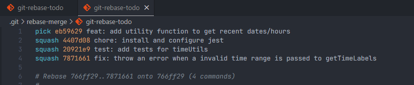
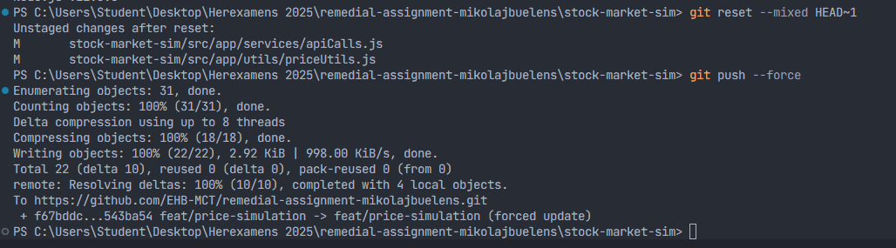

# Progress Documentation🔬

#### This document tracks the progress made during the project, including recent changes and decisions made during development as well as the rationale behind them.

## 05-08-2025

- Set up folder structure following Next.js App Router best practices including grouping of routes by main features -> [(Next.js Route Grouping and other best practises)](https://nextjs.org/docs/app/getting-started/project-structure#route-groups)
- Created components/, services/, utils/ based on SOLID separation of concerns and Next.js best practices
- Added .gitkeep to keep folders tracked in Git while empty
- Created initial README.md, CHANGELOG.md, LICENSE, CONTRIBUTING.md, CODE_OF_CONDUCT.md and progress.md files
- Decided not to use TypeScript (yet) to keep scope manageable

## 06-08-2025

- Added the chart.js/react-chartjs-2 library to visualize stock prices
- Created a initial StockChart component to display stock prices using Chart.js (currently using dummy data)
- Structured CSS files more logically with component and layout folders and added initial styles with CSS modules to prevent bloated global files
  - Styles that apply to the base layout (all pages) are still kept in `src/app/styles/` such as `globals.css` and the newly added `reset.css` and `variables.css` files

## 07-08-2025

- Added utility function to get recent dates/hours in `src/app/utils/timeUtils.js`, since I plan to use this for multiple components (General stock chart, portfolio chart, etc.)
- Implemented Jest tests for the utility function in `__tests__/timeUtils.test.js` with the help of the Next.js documentation -> I considered other testing libraries but Jest seems to be the most widely used and well-supported for Next.js projects as well as the industry standard for React applications.
- Fixed issues found during testing, including handling of invalid time ranges
- Executed a **git rebase (squash)** to clean up the 4 commits for timeUtils (initial feature, Jest installation, tests, fixes) into a single commit for clarity. I did have some issues, caused by some rookie mistakes (not force pushing, saving changes during the rebase causing conflicts), though nothing that I couldn't resolve with a second rebase.

  

<small style="margin-left: 2em;">Using the rebase command opened a Gitlens window (locally installed extension) but I opted to use the text editor instead to get a better feel for the default process.</small>

## 09-08-2025

- Removed the `src/app/styles/variables.css` and moved my CSS variables into globals.css because CSS Modules scope class names locally but do not scope variables or element selectors. This "impure selector" behavior means that variables defined in a module are still globally accessible, so keeping them in globals.css is clearer and avoids confusion. -> [GitHub discussion](https://github.com/vercel/next.js/discussions/17089)
- Added a "period picker" component to select the time range for the stock chart, allowing users to choose between one or more days, months, and years. Added a button component to apply the selected time range to the chart.
- Apart from some minor tests and possible improvements, I plan on merging this branch into development (tomorrow), since the basic UI functionality of the chart is now in place and I'd like to shift my focus to the database and API integration.

## 10-08-2025

- I chose to use Supabase as the backend database since it already is a part of the Next.js/Vercel ecosystem and provides a user-friendly API and GUI for database management. It also has some decent out-of-the box authentication, which I might use later on depending on the need for user accounts.
- Added Supabase as the backend database (postgres)
- Created a `supabase.js` file in `src/app/_lib/` to initialize the Supabase client with environment variables for the URL and anon key
- Created a `services/apiCalls.js` file to handle API calls to the Supabase database, including functions for CRUD operations. (something I saw used a lot during my internship)
- Created an API route for companies in `src/app/api/companies/route.js` to fetch company data from the Supabase database as an initial test of the db integration
- Added a `.env.example` file to provide a template for environment variables needed for Supabase, like the URL and anon key.
- Lost some time trying to figure out why the initial API route resulted in an empty array, turned out to be [Supabase's/postgres's RLS (Row Level Security)](https://supabase.com/docs/guides/database/postgres/row-level-security) being enabled by default, which requires setting up policies for data access. For now I simply disabled RLS for the companies table since I'm still in early backend development and just required some quick testing.

## 13-08-2025

- I used the Supabase data to populate the CompanyCard components, ran into some CORS issues (since I was trying to send requests from localhost to the Vercel deployment link). I tried to resolve this with headers but ended up just adding the URL in the env to switch between development and production links.
- Executed some additional rebases in order to clean up commit history which included WIP commits, which were used to check deployment logs and updates related to the cors issues mentioned above.
- Lost time trying to figure out a "hydration" error, thrown by Next, caused by the CompanyCard component. Ended up being caused by a wrong image path for the company logo's.
- Manually added extra rows in the Supabase table for companies to ensure there was enough data for testing the UI and simulation later on.
- Added a MAJOR version bump to the changelog since this is the first release that uses an API call on boot/MarketOverview page, and needs to have the correct env variables set else it will break. I also set the MINOR and PATCH versions back to 0 as per [semantic versioning](https://semver.org/).
  > "Patch and minor versions MUST be reset to 0 when major version is incremented."

## 14-08-2025

- Implemented the `updateStockPrices` function in `utils/priceUtils.js` to simulate market price fluctuations based on random generated volatility, using the `Math.random()` function to generate random price changes. The volatility is a variable that could be improved/made more realistic in the future. (i.e. using news events, market trends, sector performance, etc.)
- Updated the API route for updating stock prices to use the new utility function, this isn't a endpoint that is used directly on the frontend code (no fetch) rather it will be called via a (Vercel) cronjob so that even when the backend is not actively being used, the stock prices can still be updated resulting in a more realistic simulation and chart history.
- Didn't add a Jest test for the new utility function since it's rather simple and doesn't require extensive testing. Though this could definitly be done in the future if volatility becomes more complex.
- The cron job will be implemented later when deployment is complete/more stable, for now I used postman to send a request and I can confirm that my Supabase tables are being updated correctly.
- Added some extra documentation in the readme to clarify the purposes of endpoints and current feature branches
- I tend to "over-code" before committing, meaning I usually split my changes into smaller compartmentalized ones with different conventional commit keywords, however I did accidentally commit more than intended in a single commit. I fixed this by doing a git reset --mixed HEAD~1 so that these changes would be reset, unstaged, and ready to be split up correctly.

  

## 15-08-2025

- Created a seeder (`src/app/seeders/priceHistorySeeder`) for populating initial price history data going back a year, tried to add a different amount of data points over specific periods so that the chart would not be overloaded with data. (i.e. more data points for recent days, and fewer for past months, year)
- Installed dotenv to be able to run seeder since it doesn't automatically load environment variables like Next.js does
- Tried to add new data with a Vercel cron job but free accounts are limited to 1 per day so I dropped the idea and will manually update prices/with a local interval.
- Added a 5 minute interval to fetch of price history in order to get latest prices.
- Added a hook `usePriceHistory` for fetching and managing price history data in components. Used a hook instead of a service function since it allows for stateful logic and easier integration with my components.
- Added various styling (button selection, red/green profit/loss indicators)
